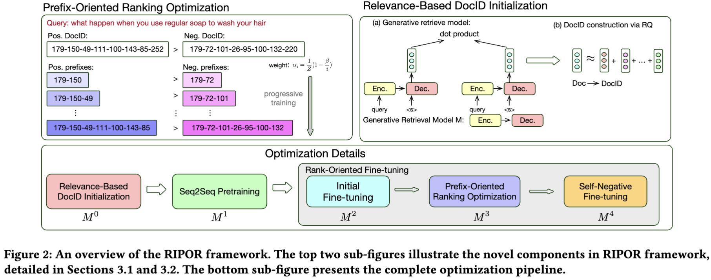

# Scalable and Effective Generative Information Retrieval
This repo provides the source code and checkpoints for our paper [Scalable and Effective Generative Information Retrieval]() (RIPOR). We propose RIPOR, a optimization framework for generative retrieval. RIPOR is designed based on two often-overlooked fundamental design considerations in generative retrieval. To addresse the issues, we propose a novel prefix-oriented ranking optimization algorithm and relevance-based DocID initialization, which illustrated in the following Figure. The main experiment is conducted on large-scale information retrieval benchmark MSMARCO-8.8M, and evaluated on three evaluation sets MSMARCO-Dev, TREC'19 and 20. RIPOR surpasses state-of-the-art generative retrieval models by a large margin (e.g., 30.5% MRR improvements on MS MARCO Dev Set), and perform better on par with popular dense retrieval models.

<p align="center">
  
</p>


## Package installation
- pip install -r requirement.txt 
- pip install torch==1.10.0+cu111 -f https://download.pytorch.org/whl/torch_stable.html
- conda install -c conda-forge faiss-gpu 

## Download files 
All necessary training files and checkpoints can be downloaded from [Ripor_data](). First you should download `RIPOR_data/data/`
- If you only want to do inference, you just need to download the following files:
    - `RIPOR_data/experiments-full-t5seq-aq/t5_docid_gen_encoder_1/aq_smtid/docid_to_smtid.json`
    - `RIPOR_data/$experiment_dir/t5seq_aq_encoder_seq2seq_1_lng_knp_self_mnt_32_dcy_2/checkpoint`
- If you want to train models by youself:
    Please read the `Training` section carefully and download the files you need. 

## Inference 
We use 4 A100 GPUs to run the model. You can use other types of GPUS like V100, but might take longer time.
``` 
bash full_scripts/full_evaluate_t5seq_aq_encoder.sh 
```
The results you obtain should be the same as reported in our paper.
## Training
Our framework contains multiple training phases (see details from Figure 2 in the paper). You can train it sequentially from the starting phase or we provide the checkpoint for each phase that you can directly use it for the subsequent phases. 

### Phase 1: Relevance-Based DocID initialization ( $M^0$ )
You will start from `t5-base` and obtain the model $M^0$ after this phase. This phase treat the T5 model as a dense encoder, and we use the two-stage training strategy to train it. In first stage, we use the BM25 negatives. You should run the following script to train the model:
```
bash full_scripts/full_train_t5seq_encoder_0.sh
```
Run the following script for the second stage training:
```
bash full_scripts/full_train_t5seq_encoder_1.sh
```
Now, you obtain the model $M^0$. Congrats! Let's use the $M^0$ to get the DocID for each document. Before running the script `full_scripts/full_evaluate_t5seq_aq_encoder.sh`, you should change the `task` variable in line 3 as `task=all_aq_pipline`. After that, you run this script:
```
bash full_scripts/full_evaluate_t5seq_aq_encoder.sh
``` 
### Phase 2: Seq2Seq Pretraining + Initial Fine-tuning ($M^2$)
You will start from $M^0$ and obtain $M^2$ after this phase
#### If you skip the phase 1 
Download all files from folder `experiments-full-t5seq-aq/t5_docid_gen_encoder_1` in which it contains training files and checkpoint you need for this phase. 
Run the script:
```
bash full_scripts/full_train_t5seq_seq2seq_0_1_pipeline.sh
```
#### If you train the $M^0$ by yourself in phase 1
You should create your own training set with the following procedure:
- Change the `task` variable in line 3 as `task=retrieve_train_queries` in script `full_scripts/full_evaluate_t5seq_aq_encoder.sh`. Then run the script:
    ```
    full_scripts/full_evaluate_t5seq_aq_encoder.sh
    ```
- Use the teacher model (cross-encoder) to rerank the obtained run.json file
    ```
    full_scripts/rerank_for_create_trainset.sh
    ```
- Add the qrel (relevant docid) for training set
    ```
    python t5_pretrainer/aq_preprocess/add_qrel_to_rerank_run.py
    ```
- Then run the script:
    ```
    bash full_scripts/full_train_t5seq_seq2seq_0_1_pipeline.sh
    ```

### Phase 3: Prefix-Oriented Ranking Optimization ($M^3$)
#### If you skip the phase 1 and phase 2
Download all files from `experiments-full-t5seq-aq/t5_docid_gen_encoder_1` and `experiments-full-t5seq-aq/t5seq_aq_encoder_seq2seq_1`, they provide you with checkpoints, training data, and initialized DocIDs. You start from $M^2$ and obtain the checkpoint $M^3$ after that. Run the script:
```
bash full_scripts/full_lng_knp_train_pipline.sh
```
#### If you do not skip the phase 1 and phase 2
You are only one step away from success! But be patient, it might take some time. Since we build the DocID by ourselves, we should generate our own training data. Follow the following procedures for data generation. 
- Apply the constrained beam search on $M^2$ to generate training data for different prefix length:
    Change the `task` variable in line 3 as `task=t5seq_aq_get_qid_to_smtid_rankdata` in script `full_scripts/full_evaluate_t5seq_aq_encoder.sh`. Then run the script:
    ```
    full_scripts/full_evaluate_t5seq_aq_encoder.sh
    ```
    Note that in our paper (Sec 3.3.3), we call the training data as $\mathcal{D}^B$
- In our paper (Sec 3.3.3), we combine $\mathcal{D}^B$ with training data $\mathcal{D}^R$ provided from the dense encoder provided by $M^0$. To let $\mathcal{D}^R$ having the same format as $\mathcal{D}^B$, we run the following scripts:
    ```
    python t5_pretrainer/aq_preprocess/get_qid_smtid_docids_from_teacher_rerank_data.py 
    ```
    ```
    bash full_scripts/rerank_qid_smtid_docids_0.sh
    ```
- We combine the $\mathcal{D}^B$ and $\mathcal{D}^R$ and create the training examples for this phase by the following scripts:
    ```
    python t5_pretrainer/aq_preprocess/get_qid_smtids_scores_jsonl_examples.py
    ```
    ```
    python t5_pretrainer/aq_preprocess/fully_create_lng_knp_examples_from_original_examples.py
    ```
Awesome! You have all files needed for training. Run the script for training:
```
bash full_scripts/full_lng_knp_train_pipline.sh 
```